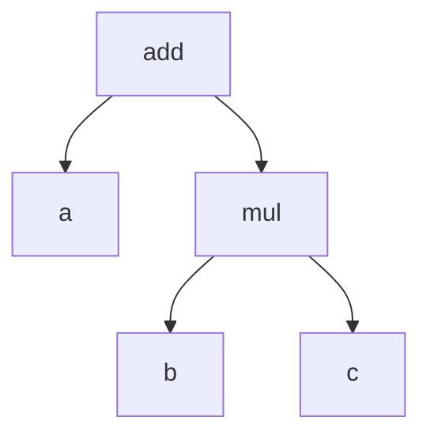

# SYMPY Prefix
This is a package for converting [sympy](https://www.sympy.org/en/index.html)
expressions to prefix notation.
There is standard prefix notation and a custom one with shorter sequences that I call "hybrid prefix notation".
Hybrid not in the sense that it's half infix, but because it uses parentheses for some operators and not for others.

# What?
It's best explained with an example:
The sympy expression
```a + b*c```
is transformed to the list of strings
```
['add', 'a', 'mul', 'b', 'c']
```
which is the prefix notation as apposed to the infix notation above.
This is equivalent to a depth first traversal of the tree


# Why?
Recently in Machine Learning there has been a seminal paper on [Deep Learning for Symbolic Mathematics](https://arxiv.org/abs/1912.01412)
where the authors show that with neural networks they can symbolically solve tasks like integration
and differential equations.
There, the authors are using prefix notation to encode the expressions.
Specifically, this package was written for my Google Summer of Code (GSoC) project on [SYMBA](https://arxiv.org/abs/2206.08901).
I have been working to extend the model to use prefix notation.

# Hybrid Prefix Notation
It turns out that prefix notation only "works" without parentheses if each operator has a fixed number of arguments.
For example the multiplication of three elements, `a+b+c` would have to either be
```
+ a + b c
```
or
```
+( a b c )
```
I have described in [this blogpost](http://127.0.0.1:4000/machine/learning/feynman/physics/symba/2022/07/14/Introduction-Feynman-Amplitudes-Project.html)
why.
Always adding parentheses to each operator would make the sequences much too long for a transformer architecture for the use case of SYMBA.
Of course one could add a separate multiplication and addition operator for each number of arguments,
`+2 a b`, '+3 a b c', `+4 a b c d` and so on, but here I went for introducing only one extra operator
`+(` together with a closing parenthese: "+( a b c ... )" which is used as soon as there are more than two arguments.

